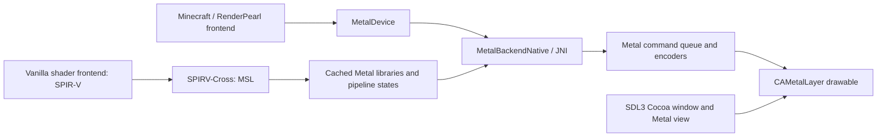

# Direct Metal architecture for Minecraft 26.3

There is no Vulkan runtime in this path. SPIR-V is an intermediate shader format,
and SPIRV-Cross is a shader compiler, not a Vulkan driver.

## Window and backend selection

`BackendSelectionMixin` selects Cuprum by default on supported Macs. The native
library bootstrap bypasses Minecraft's Vulkan loader. `CuprumBackend` creates an
`SDL_WINDOW_METAL` window without OpenGL or Vulkan flags, then returns a
`FrontendGpuDevice` backed by `MetalDevice`.

`CocoaMetalBridge` obtains the NSWindow through SDL's Cocoa window property and
queries contentView and backingScaleFactor using ABI-correct Objective-C calls.
`SDL_Metal_CreateView` creates and owns the layer-hosting NSView and CAMetalLayer,
preserving SDL's input and resize handling. The attachment owns the SDL Metal view
and destroys it on the macOS main thread. Surface acquisition refreshes Retina
scale and sets drawableSize from the framebuffer configuration in pixels.

Minecraft 26.3 has no GLFW window, `BufferRenderer.drawWithShader`, or old
Tessellator flush contract. Implementing its backend interfaces intercepts all
vanilla submissions, including terrain, GUI, textures, lightmaps and post passes.
The five mixins are narrowly scoped to backend selection, library bootstrap,
window diagnostics, RenderSystem diagnostics and the frame presentation boundary.

## Shader and pipeline translation

RenderPearl compiles each vanilla GLSL variant to SPIR-V and remaps attributes and
uniform bindings. `MetalPipeline` translates those modules with a separate
SPIRV-Cross context per compilation worker. It requests MSL 2.4, native texture
buffers, and a vertex Y flip matching RenderPearl's zero-to-one coordinate
convention. Counter-clockwise source geometry becomes clockwise after this flip;
the native render encoder uses clockwise front faces. Presentation performs the
final texture-orientation conversion.

The backend preserves reflected vertex offsets, formats, strides and instance
step rates in MTLVertexDescriptor. Metal buffer slots 0–14 hold uniform blocks,
slot 15 holds push constants, and slots 16–30 hold vertex buffers. Texture and
sampler slots match the frontend's uniform binding indices. Extra bindings fail
with a clear error rather than silently aliasing slots.

Translated source and entry points outlive the SPIR-V modules. Native shader
libraries are cached by source; immutable PSOs are cached per Java pipeline and
actual depth attachment format. PSOs carry attachment formats, blend equations,
write masks and depth state. Culling, wireframe and depth bias are set when binding
the pipeline. Current RenderPearl exposes depth/bias through DepthStencilState;
it does not expose legacy GlStateManager stencil operations. Packed depth/stencil
attachments are retained across passes, without inventing nonexistent stencil hooks.

Metal cannot sample three-component RGB texture formats; these are rejected.
D24/S8 is used only on devices advertising that format, never reinterpreted as
D32/S8 with a different byte layout. Vanilla's normal RGBA and D32 resources are
supported. Optional device formats and Intel-specific behavior need hardware testing.

## Commands, memory and synchronization

`MetalEncoder` provides clears, render passes, uploads, copies, fences and queries.
`MetalPass` binds resources and submits direct, indexed, instanced and indirect
draws. Multiple indirect draws are encoded individually. Direct triangle fans are
expanded into shared index buffers; indexed fans use a GPU compute expansion.
Indirect fans resolve their GPU argument counts before allocating the expanded
stream; this uncommon compatibility path synchronizes and is slower than other draws.
Render pass splits preserve attachments, bindings, viewport, scissor and debug groups.

Buffers use shared storage. Three upload arenas hold reusable pages, fence every
submission and wait only when reusing an arena whose GPU work is unfinished.
Write-mapped Minecraft ring buffers rely on Minecraft's fences before reuse;
read maps synchronize. Uniform allocations include trailing padding required by
MSL structure alignment, while Java exposes the requested logical byte length.
Misaligned texel-buffer slices are copied into aligned storage before binding.

Textures use private storage, with shared staging buffers for transfers. CPU pixel
uploads and readbacks use padded rows; readback callbacks strip that padding after
GPU completion. Callback polling happens before an arena can overwrite its staging
pages. Completed command buffers remain retained until all owning fences and
callbacks release them. Encoded Metal commands retain their resource objects, so
closing a Java resource does not free an allocation already referenced by a command.

All queue encoding and resource management occur on the creating render thread.
Only shader translation runs on compilation workers. JNI objects have explicit
retained handles, ARC ownership and per-call autorelease pools. Device shutdown
waits for submitted work, completes callbacks and closes owned resources.

## Presentation and timestamps

The surface acquires at most one drawable per frame and uses CAMetalLayer's three
available drawables. A fullscreen pass scales the game's color texture into a
framebuffer-only BGRA8 drawable. Presentation is scheduled on the same command
buffer before Minecraft submits it; the later `GpuSurface.present` hook releases
the surface's acquired reference. A three-permit semaphore bounds in-flight
command buffers and completion handlers release permits.

Zero-sized or iconified surfaces produce SurfaceException and let Minecraft retry;
configuration changes resize the layer on the next acquisition. FIFO and immediate
presentation map to CAMetalLayer.displaySyncEnabled.

Minecraft constructs TimerQuery unconditionally. Query pools use actual Metal
counter sample buffers and return values only after the recorded command buffer
completes. GPUs with draw-boundary counters sample directly. Stage-boundary GPUs
split and restore an active render encoder and insert a sampled blit encoder.
A small marker operation ensures timestamp encoders are not optimized away.
Calibration samples the device GPU clock against Java's monotonic clock.

## Native files and verification

`cuprum_backend.m` and `MetalBackendNative` implement the game backend. The original
`cuprum_metal.m`, `MetalNative`, `MetalRenderer` and `CuprumPipeline` also retain a
small independent MSL rendering diagnostic used by `NativeSmoke`. Both native
implementations are linked into one universal macOS dylib; neither links Vulkan.

Verification includes the native GPU readback test and a Java encoder test with
12 submissions, asynchronous callbacks and repeated arena rotation. The Fabric
client loaded vanilla shaders and texture atlases, rendered the title screen and
entered a single-player world on an M1 Pro under Metal API validation. GPU frame
captures were inspected for lighting, textures, text and orientation. A process
library map showed Cuprum's Metal dylib with no Vulkan loader or MoltenVK.

Intel compilation is verified by the universal binary's two architecture slices.
Intel runtime behavior, shader packs, extensive mod compatibility, all dimensions
and long-duration performance are not established by this validation. Direct, indexed and indirect fan conversion is covered by the native test. No general performance
improvement is claimed from a single development session.
