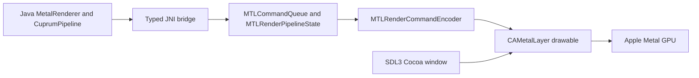

# Direct Metal architecture for Minecraft 26.3

Cuprum's native rendering path is now:

This path executes no Vulkan commands and uses no MoltenVK translation. Native MSL
is compiled by `MTLDevice.newLibraryWithSource`, and the actual render pipeline is
created by `newRenderPipelineStateWithDescriptor`.

## What is implemented

`CocoaMetalBridge` obtains the macOS NSWindow through SDL3's native window property,
queries its contentView and Retina backing scale, and creates an SDL-managed
layer-hosting Metal view. SDL manages the view's Cocoa resize notifications;
Cuprum re-queries backing scale and framebuffer pixel dimensions each frame.
`MetalRenderer` supplies drawableSize in pixels before acquiring nextDrawable.

`MetalNative` loads the packaged ARM64 JNI bridge. An optional absolute library
path can be provided with `-Dcuprum.nativeLibrary=/path/to/libcuprum_metal.dylib` for
native debugging. The bridge owns the device, command queue, sampler, native MSL
library's PSO, and active frame objects through Objective-C ARC.

`MetalRenderer` wraps native handles with explicit ownership and thread checks. It
owns allocated buffers and textures, and borrows the Metal layer. Native allocations
are immutable uploads in shared storage; dynamic uploads currently allocate a new
buffer rather than overwriting memory the GPU may still be reading.

`CuprumPipeline` demonstrates the position/color/texture shader family, including
vertex and uniform uploads and a real draw. This pipeline is implemented for its
own MSL shader; it does not compile Minecraft's full shader library or shader packs.

`NativeSmoke` exercises the complete path with a textured triangle. Native image
inspection additionally verifies that no Vulkan loader or MoltenVK dylib was
loaded in the process.

## PSO and shader layout

The color attachment is BGRA8Unorm, the primitive topology is triangles, and the
initial pipeline uses a color-only pass without depth or blending. The native
vertex descriptor binds:

| Attribute | Format | Byte offset |
|---|---|---|
| Position | float3 | 0 |
| Color | normalized unsigned RGBA8 | 12 |
| UV | float2 | 16 |

Vertex stride is 24 bytes, with per-vertex stepping and buffer index 0. The uniform
block is an 80-byte, 16-byte-aligned layout: a column-major float4x4 MVP followed by
a float4 tint. It binds at vertex buffer index 1. The sampled RGBA8 texture and
nearest/clamp sampler bind at fragment index 0. No descriptor sets, Vulkan handles,
or SPIR-V shader module are involved in this native implementation.

The MSL shader currently applies the MVP matrix and multiplies sampled texture
color by vertex color and tint. The MVP must use Metal's 0..1 clip-space depth
convention when expanded to depth-tested geometry.

## Frame and resource lifetime

1. Query drawable size in pixels and begin a frame. Zero-sized or temporarily
   unavailable surfaces return no frame.
2. Acquire a CAMetalLayer drawable, allocate a command buffer and begin the render
   encoder with explicit clear/store actions.
3. Bind the PSO, vertex/UBO buffers, texture and sampler; record triangle draws.
4. End encoding, schedule the drawable presentation, and commit once.

A frame must be submitted explicitly. Closing an unsubmitted frame cancels its
command buffer; it does not display partially recorded work. A renderer allows
only one CPU-recorded frame at a time. Normal submission is asynchronous and uses
Metal's default retained resource references. GPU failures are reported by a
native completion handler; diagnostic readback waits for completion and throws on
command-buffer failure.

Diagnostic readback inserts a Metal blit into a shared buffer, respects 256-byte
row alignment, waits for completion, and returns tightly packed top-down BGRA8
pixels. The layer's framebufferOnly property is disabled for this test capability;
a future production path should enable it when readback/blits are unnecessary.

Buffers and textures can release their owning reference after submission because
Metal command buffers retain encoded resources through completion. Closing the
renderer drains its serial queue before releasing the device and resources.
**Close renderer → close layer attachment → destroy SDL window.** Every view,
frame and resource operation uses the Cocoa main thread. JNI never uses a saved
JNIEnv from an asynchronous Metal completion handler.

## Minecraft adapter boundary

Minecraft 26.3 uses SDL3 windows, unobfuscated class names, and RenderPearl's
`GpuBackend`/`GpuDeviceBackend` APIs. Cuprum no longer extends the game's Vulkan
backend. `CuprumBackend` implements `GpuBackend` directly and can create an
SDL_WINDOW_METAL window and load the native bridge.

A working native draw does not satisfy the complete RenderPearl device contract.
`createDevice` therefore reports a clear `BackendCreationException` until a real
adapter exists. It does not silently create a Vulkan or OpenGL device. Explicit
Metal selection has no fallback. Default diagnostic mode chooses vanilla OpenGL
and is labeled accordingly in logs and documentation.

`NativeLibrariesBootstrapMixin` skips Minecraft's early Vulkan loader probe on
supported Macs while Cuprum is enabled. `BackendSelectionMixin` excludes Vulkan
from backend attempts. The bootstrap flag also prevents Minecraft's default
Vulkan availability check from loading a device. Minecraft still declares Vulkan
jars in its own library list; removing those jars would change the game
installation rather than just this mod. They are not part of Cuprum's rendering
path.

`WindowMixin` and `RenderSystemMixin` remain version-specific integration seams.
The presentation hook wraps `Minecraft.renderFrame(boolean)`'s
`GpuSurface.present()` call. In diagnostic mode that is the OpenGL surface; it
becomes useful for Metal only after an actual Metal surface adapter is supplied.
It never acquires a second drawable or submits a duplicate frame.

## Remaining renderer work

A playable Metal game backend must implement the actual 26.3 interfaces:

- `GpuDeviceBackend`: textures/views, buffers, samplers, pipeline compilation,
  device limits/features, debug information and timestamp queries.
- `CommandEncoderBackend`: render-pass creation, transient allocations, all
  buffer/texture upload and copy paths, fences and submission.
- `RenderPassBackend`: arbitrary PSO bindings, uniform/texture binding remaps,
  push constants, depth/stencil, blend/scissor state, indexed/instanced/indirect
  draws and optional multi-draw capabilities.
- `GpuSurfaceBackend`: configuration, acquisition, texture-to-drawable blit,
  synchronization, presentation, resize/minimize recovery and shutdown.

The shader integration must also supply MSL for Minecraft's pipeline library and
match its bind-group and vertex layouts. RenderPearl's existing frontend exposes
compiled shader IR to its backend; adapting or replacing that frontend is a
separate shader-compiler task. A standalone shader translator can be used without
a Vulkan runtime, but the current renderer uses handwritten MSL and has no such
translator dependency. Missing capabilities must be reported honestly rather
than returning dummy resources or skipping required draws.

Implement and validate these contracts incrementally before enabling Metal game
rendering by default. Compatibility with resource reloads, offscreen passes,
world rendering, shader packs and other rendering mods needs dedicated coverage.

## Validation

Direct Metal validation on an Apple M1 Pro passed: 120 textured frames, exact GPU
pixel readback (RGBA 200/110/60/255), drawable resize, zero-extent skip, frame
cancellation/recovery, and absence of loaded Vulkan/MoltenVK dylibs. Metal reports
unified memory. Platform guard tests cover ARM64 Java and macOS version handling.
A Fabric diagnostic launch also applied all five mixins, selected OpenGL, and
loaded game resources. Process memory-image inspection found no Vulkan loader or
MoltenVK dylib. The diagnostic client was deliberately stopped with SIGTERM;
Gradle reports exit code 143 for that stop, rather than a clean game exit.
Mixed-DPI movement, prolonged GPU stress and multiple concurrent surfaces remain
untested. The previous Vulkan game-startup validation does not apply to this new
renderer architecture.
